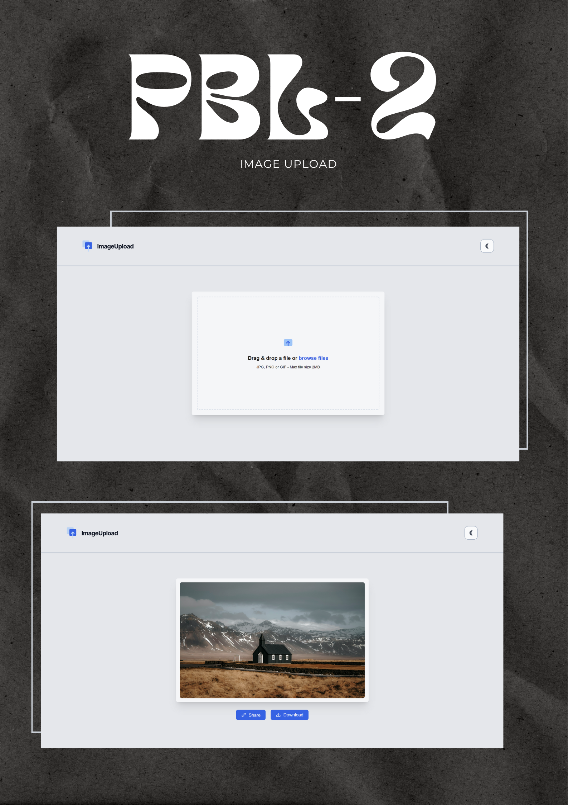

# PBL2-imageUpload
 
Welcome to another series of "Project-Based Learning" (PBL). This time I will be learning more about images - uploading, downloading, and using the backend to handle the logic.

# What I Used?

## Frontend

#### Vanilla JavaScript
#### Tailwind CSS
- It's my first time using Tailwind, took me some time to get the hang of it but I see how efficient it can be. Planning to use this in future PBL's (Project-Based Learning).

## Backend

#### Express & Node Js
#### Multer
- using this middleware to handle files was suprisingly simple, just had to look at some docs and viola I now can easily send files to the server.

# What I learned?

- This project was fun to make I had numerous roadblocks such as drag and drop functionality and configuring tailwind and the backend where I can store the upload images.
- I learned about drag and drop HTML API which enabled the drag-drop functionality.
- Using Fetch API and getting the response from the server to be displayed on the client side.
- Using Tailwind to implement Dark Mode